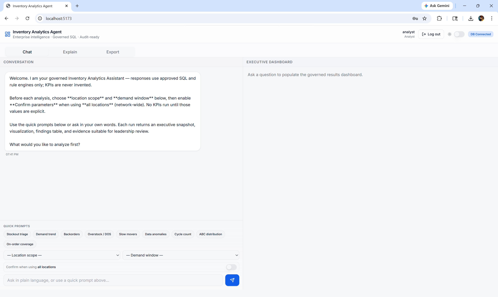
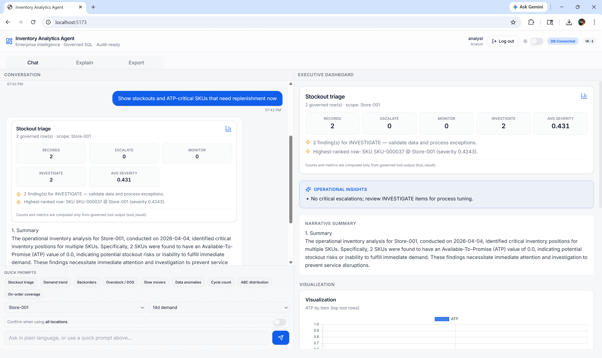
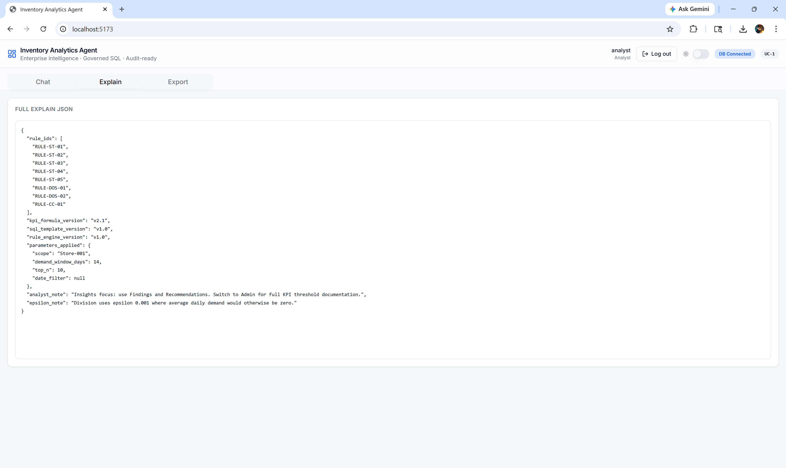
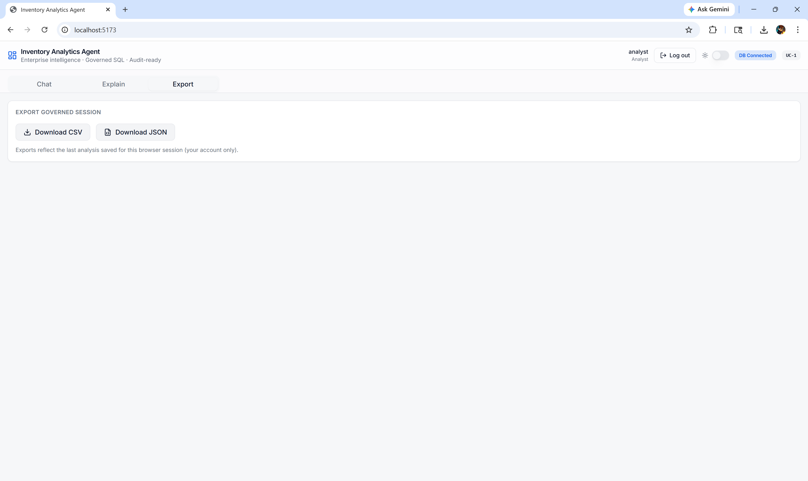
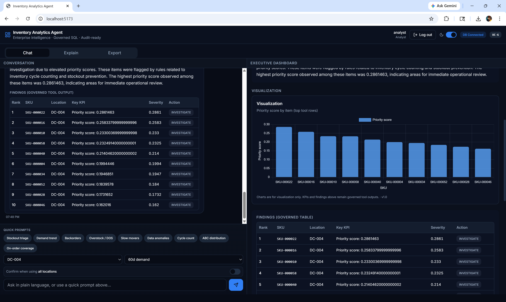

# Inventory Management System

An AI-assisted inventory management dashboard for exploring supply-chain data, asking natural-language questions, generating governed SQL plans, viewing KPIs, and exporting results.

The project combines a FastAPI backend, DuckDB analytics database, Gemini-powered agent orchestration, and a React/Vite frontend.

## Built Through Vibe Coding

This project was built through vibe coding using Cursor, with an iterative AI-assisted workflow for designing the backend agents, shaping the governed analytics experience, and refining the React interface.

## Features

- Natural-language inventory analysis through a governed AI agent flow
- Role-based login for Analyst, Supervisor, Auditor, and Admin users
- DuckDB-backed inventory data loaded from Excel
- KPI calculations, rule checks, SQL templates, and audit logging
- Interactive React dashboard with tables and visualizations
- CSV and JSON export endpoints
- Backend tests for auth, health checks, orchestration, and planning

## Tech Stack

- Backend: Python, FastAPI, DuckDB, Pandas
- AI: Google Gemini API
- Auth: JWT, bcrypt
- Frontend: React, TypeScript, Vite, Tailwind CSS, Chart.js
- Testing: Pytest, HTTPX

## Screenshots

### Chat Workspace



### Stockout Dashboard



### Explain JSON



### Export Session



### Dark Mode Findings



## Project Structure

```text
.
|-- agents/                    # Agent router and pipeline logic
|-- frontend/                  # React/Vite frontend
|-- static/                    # Built/static frontend assets
|-- tests/                     # Backend test suite
|-- auth.py                    # JWT and password helpers
|-- bootstrap_data.py          # Excel and DuckDB bootstrap logic
|-- config.py                  # Environment-driven app config
|-- main.py                    # FastAPI app and API routes
|-- requirements.txt           # Python dependencies
`-- run_server.bat             # Windows backend launcher
```

## Getting Started

### 1. Clone the repository

```bash
git clone https://github.com/iamkarandeepsingh/Inventory-Management-System-.git
cd Inventory-Management-System-
```

### 2. Create a Python virtual environment

```bash
python -m venv .venv
.venv\Scripts\activate
pip install -r requirements.txt
```

### 3. Configure environment variables

Create a `.env` file in the project root:

```env
GEMINI_API_KEY=your_gemini_api_key_here
GEMINI_MODEL=gemini-2.5-flash
JWT_SECRET=replace_with_a_long_random_secret
DUCKDB_PATH=./data/inventory.duckdb
JWT_EXPIRE_MINUTES=480
```

Do not commit `.env`. It is already ignored by Git.

### 4. Start the backend

On Windows, run:

```bash
run_server.bat
```

Or start FastAPI directly:

```bash
python -m uvicorn main:app --reload --host localhost --port 8001
```

The app will be available at:

- App: http://localhost:8001
- API docs: http://localhost:8001/docs
- Health check: http://localhost:8001/api/health

### 5. Start the frontend for development

```bash
cd frontend
npm install
npm run dev
```

## Default Login Accounts

When the database is initialized, these development users are seeded:

| Username | Password | Role |
| --- | --- | --- |
| `analyst` | `analyst123` | Analyst |
| `supervisor` | `supervisor123` | Supervisor |
| `auditor` | `auditor123` | Auditor |
| `admin` | `admin123` | Admin |

For production, change seeded credentials and set a strong `JWT_SECRET`.

## API Endpoints

- `POST /api/auth/login` - sign in and receive a JWT
- `GET /api/auth/me` - return the authenticated user
- `GET /api/health` - service health check
- `POST /api/chat` - submit an inventory question to the AI agent
- `GET /api/export/csv` - export query results as CSV
- `GET /api/export/json` - export query results as JSON

## Running Tests

```bash
pytest
```

## Notes

- `.env`, `.venv`, Python caches, pytest caches, DuckDB files, frontend dependencies, and generated app assets are ignored.
- The tracked Excel workbook is used as the seed data source for the inventory database.
- A local file named `import os.py` is ignored because it was used for scratch experimentation and should not be uploaded.
